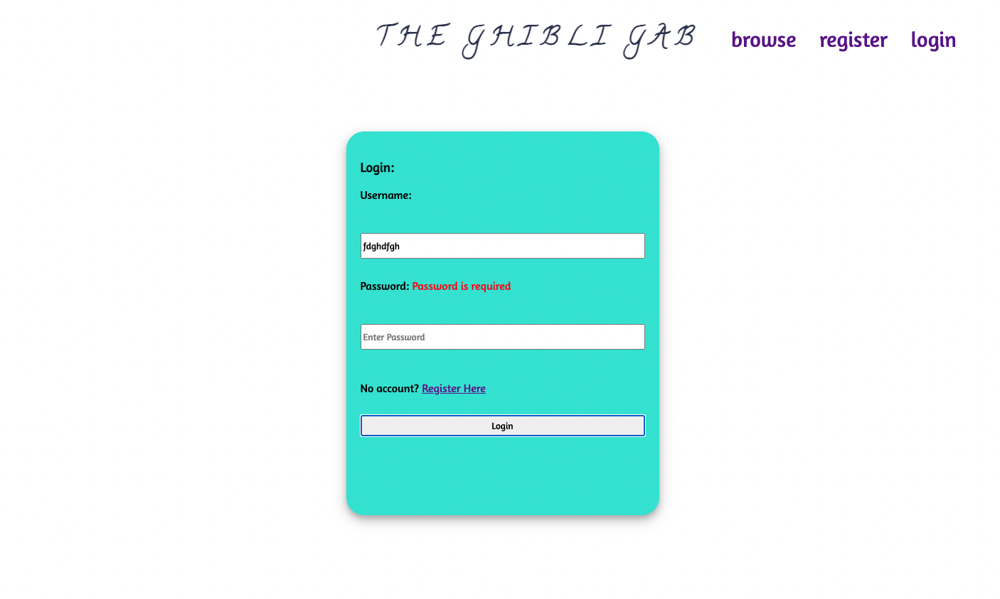
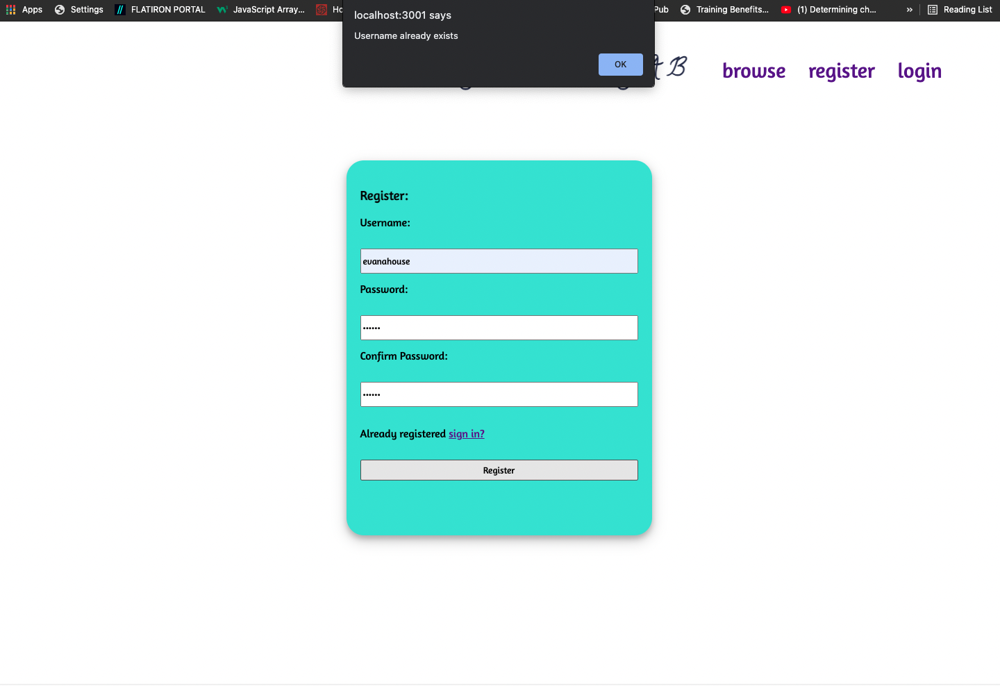
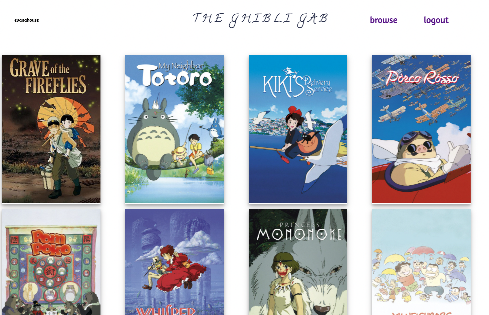
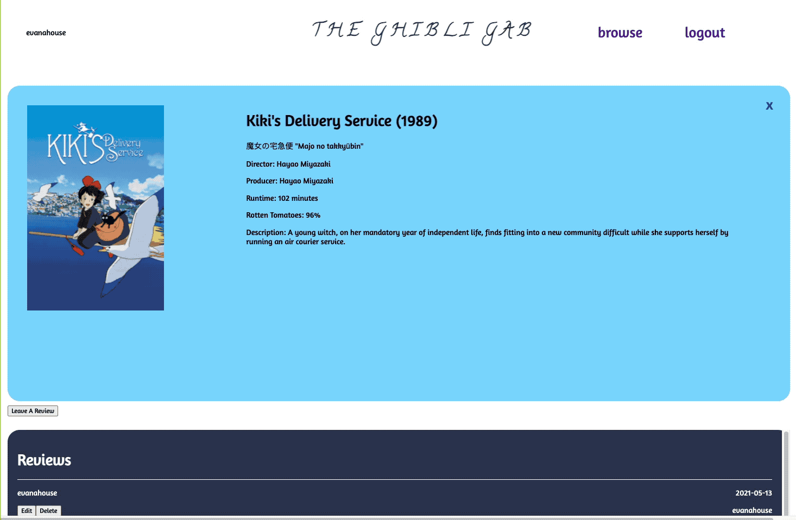

# Welcome to The Ghibli Gab!

## Studio Ghibli API: https://ghibliapi.herokuapp.com/#section/Studio-Ghibli-API 

### Minimum Viable Product (MVP)

- As a user I sign-up/login to my account
- As a user I can see all studio-ghibli films on home page
- As a user I can select a film, which brings up show-more page
- As a user I can Create, Edit, Delete a review on a particular film

### Stretch Goals

- As a user I can click on any user, and see their profile and reviews
- User Authentication
- As a user I can like a review
- As a user I can filter these films through search

## Models

- User:
  - Attributes:
    - username
    - password or password_digest(stretch)
    - name
  - Associations:
    - has_many :reviews
    - has_many :movies, through: :reviews
- Review:
  - Attributes:
    - title (string)
    - content (text)
    - score (integer)
    - user_id (integer/foreign-key)
    - movie_id (integer/foreign-key)
    - like (integer) (stretch)
  - Associations:
    - belongs_to :user
    - belongs_to :movie
- Movie:
  - Attributes:
    - title
    - original_title
    - original_title_romanized
    - image_url
    - description
    - director
    - producer
    - release_date
    - run_time
    - rt_score
  - Associations:
    - has_many :reviews
    - has_many :users, through: :reviews

## Login

 ## Register

## Browse

## Leave Review / Edit Review / Delete Review

